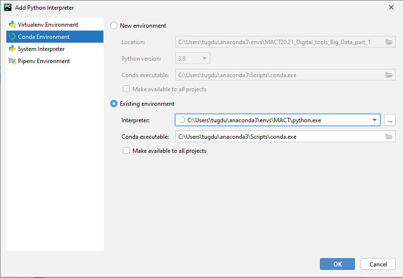
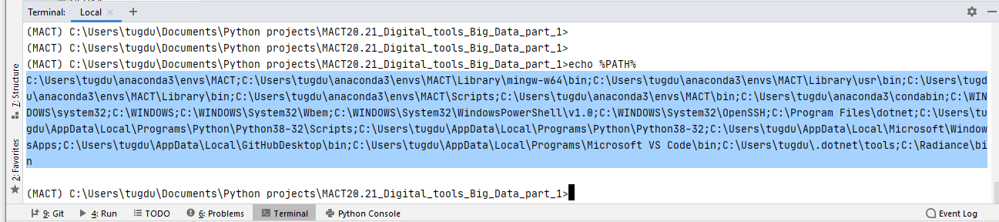
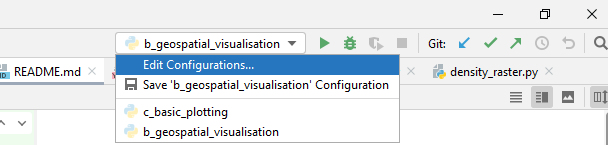

# Digital tools and Big Data - part 1

## Master in City & Technology

## Syllabus
The course has seven sessions in which students directly interact with large data sets in practical sessions to develop the technical skills highly demanded in big data projects. The sessions start by discovering big data sources, performing descriptive analytics and plotting different data sets to identify trends and correlation. The course moves towards spatial and temporal dimensions of big data sets and the way to graphically represent features from these multiple dimensions. The last part of the course deals with data management tasks such as splitting, aggregating, merging and summarising datasets to improve analysis and visualization. 

The course follows a practical methodology in which students study key concepts during the sessions and develop exercises to understand them deeply. Students have access to a GitHub repository with a compilation of source code and examples for the topics and tools used during the course. Along with the exercises, students will define a particular analysis scenario to apply the concepts seen in class. The analysis scenario might focus on a problem and a defined set of variables to analyse as well as tools to visually represent the results. Students will decide about analysis scenarios after the third session once they have explored multiple datasets and analysis tools. 

2020 - Diego Pajarito


## Anaconda env and install librairies

### Create anaconda env
Execute in a local terminal

````shell script
deactivate
conda update -n base -c defaults conda
conda env remove --name MACT

conda env create python=3.8 -f environment.yml
conda activate MACT
````

### Update PyCharm conda env config
#### Set the MACT conda env

1. Open `File/Settings` and go to `Project:.../Python Interpreter`.
2. Click on the engine button on the right and on `Add...`.
3. Add the **MACT** existing Conda environment. The path of the interpreter should be in `C:\Users\USERNAME\anaconda3\envs\MACT\python.exe`


#### Set the PATH variable

1. Open a Pycharm Termnial, execute this command `echo %PATH%` and copy the result.


2. Click on `Edit configurations ...` in this the execution menu.


3. In the environment variable field write `PYTHONUNBUFFERED=1;PATH=` and after the `=` add the result of the `echo %PATH%` command.
You should have something like this: 
```
PYTHONUNBUFFERED=1;PATH=C:\Users\tugdu\anaconda3\envs\MACT\;C:\Users\tugdu\anaconda3\envs\MACT\Library\mingw-w64\bin\;C:\Users\tugdu\anaconda3\envs\MACT\Library\usr\bin\;C:\Users\tugdu\anaconda3\envs\MACT\Library\bin\;C:\Users\tugdu\anaconda3\envs\MACT\Scripts\;C: \Users\tugdu\anaconda3\envs\MACT\bin\;C:\Users\tugdu\anaconda3\condabin\;C:\WINDOWS\system32\;C:\WINDOWS\;C:\WINDOWS\System32\Wbem\;C:\WINDOWS\System32\WindowsPowerShell\v1.0\;C:\WINDOWS\System32\OpenSSH\;C:\Program Files\dotnet\;C:\Users\tugd u\AppData\Local\Programs\Python\Python38-32\Scripts\;C:\Users\tugdu\AppData\Local\Programs\Python\Python38-32\;C:\Users\tugdu\AppData\Local\Microsoft\WindowsApps\;C:\Users\tugdu\AppData\Local\GitHubDesktop\bin\;C:\Users\tugdu\AppData\Local \Programs\Microsoft VS Code\bin\;C:\Users\tugdu\.dotnet\tools\;C:\Radiance\bin 
``` 

### Update anaconda env
When the `environment.yml` you should execute these commands in a terminal:

````shell script
conda activate MACT
conda env update --file environment.yml  --prune
````

